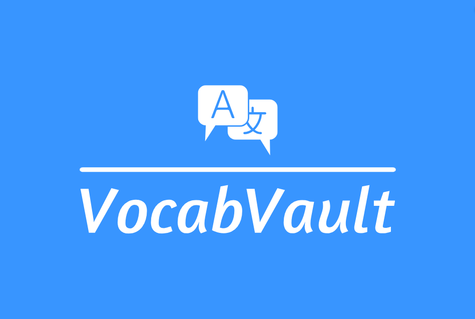

# VocabVault



**Created By :** Belal Shakra
**Email :**


## Installation

To get started, clone this repository.

```
git clone git@github.com:belal-shakra/VocabVault.git
```

Next, configure your Database connection in `.env` file.

```
DB_CONNECTION=mysql
DB_HOST=127.0.0.1
DB_PORT=3306
DB_DATABASE=YOUR-DATABASE-NAME
DB_USERNAME=YOUR-DATABASE-USERNAME
DB_PASSWORD=YOUR-DATABASE-PASSWROD
```

## Run Packages and helpers

You have to all used packages and load helpers as below.

```
composer install
npm install
npm run build
```

## Generate new application key

You have to generate new application key as below.

```
php artisan key:generate
```

## Run Seeders

You have to run seeders as below.

```
php artisan db:seed --class=LetterSeeder
```

## Run Migrations

You have to run all the migration files included with the project and also run seeders as below.

```
php artisan migrate
```
